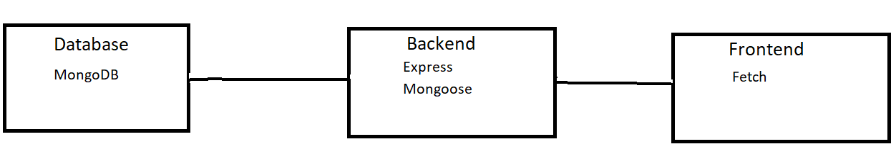
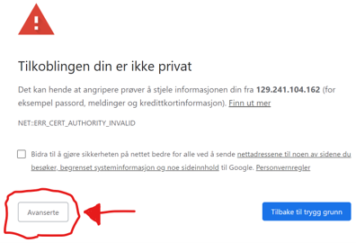
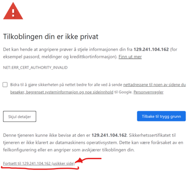

## Kjøring på gitpod

Må være på ntnu-nettet.

https://gitpod.idi.ntnu.no/#https://gitlab.stud.idi.ntnu.no/it2810-h20/team-65/prosjekt-3/-/tree/gitpod

Legg merke til at dette hentes fra Gitpod-branchen til prosjektet.

:exclamation: **NB!** Noen brukere opplever problemer med å hente data fra backend på VM :exclamation: Instruksjoner for hvordan man ordner dette finnes på bunnen, se punkt **Godkjenning av data fra VM**. 

Problemet kommer av at Gitpod krever HTTPS. Det har ikke kommet noen føringer på hvordan man skal implementere HTTPS på dataen fra VMen, og vår løsning er ikke en sikker kryptering av dataen. Dette fører til at man må godkjenne tilkoblingen.

## Kjøring på vm

Må være på ntnu-nettet.

Siden gitpod har vært litt ustabilt har vi satt opp en kjørende side på http://129.241.104.162:3001/ , 
her kan man selvfølgelig ikke kjøre testene.

## Kjøring lokalt

Må være på ntnu-nettet.

#### Backend:
1. Åpne en linux-terminal (for eksempel windows: ubuntu, mac: standard)
2. `cd backend && npm i`
3. `npm start`

#### Frontend:
1. Åpne en NY terminal (valgfri type)
2. `cd frontend && npm i`
3. `npm start`

## Test scripts

### `npm test`

Run all the cypress tests

### `npm test open`

Opens the test suite, so you can watch the cypress tests live

### `npm test chrome`

Run all cypress tests in chrome

### `npm run unit`

Run all unit tests

# Dokumentasjon

## Introduksjon

Movie database er en single page application (SPA), med en filmdatabase hvor brukeren kan finne informasjon om nesten 7000 filmer. Det er også mulig å opprette egne brukere og legge inn anmeldelser på filmene, så fremtidige brukere kan se hva du mener om disse filmene.

Vi startet prosjektet med `npx create-react-app . --template redux-typescript --use-npm` for å få en redux-typescript-template.

## Funksjonalitet

### Navigasjonsbaren:
- Brukeren kan søke på nøkkelord eller film-titler i tekstfeltet markert med **Search in titles**. Alle databasens 6820 filmer kan velges fra den virtualiserte listen, eller man kan søke på fritekst. Om man trykker på enter, velge en film fra listen eller tømme søkefeltet oppdateres filmene som vises i tabellen.
- Brukeren trykke på **Login** for å logge inn, knappen er ikke klikkbar om ikke både **Username** og **Password** tekstfeltene er fylt ut. Hvis brukeren finnes i databasen kommer en velkomstmelding med navnet på brukeren, og muligheten til å trykke  **Log Out** for å logge ut 
- Ved å trykke på **Register** blir brukeren sendt videre til et registreringsskjema, og kan registrere en ny bruker i databasen
- Webapplikasjonen støtter filtrering. Ved å huke av **Genre Filter**, **Director Filter**, **Year Filter** eller **Rating Filter** kommer det opp en/flere søkekomponent(er) hvor man kan velge det man ønsker å filtrere på. Knappen **Apply Filter** er kun klikkbar om filtreringsvalgene er oppdatert, og ved klikk vises filmene som passer med filtrene i tabellen under.
- **Theme: ####**-knappen tillater brukeren å klikke igjennom 3 forskjellig temafarger på siden: **Standard**, **Dark** og **Warm**.

### Registrering:
- Etter å ha trykket på **Register** kan man sette opp en ny bruker.
- Man må fylle ut **Username** og begge **Password**-tekstfeltene for å kunne registrere en ny bruker. Brukeren får indikasjon på om passordene er ulike.
- **Create User**-knappen er kun klikkbar hvis alle feltene er fylt. Om **Username** allerede finnes i databasen får brukeren beskjed om dette etter å ha trykket. Nye brukere blir bare opprettet dersom det ikke finnes en bruker med tilsvarende **Username** i databasen fra før.

### Tabellen:
- På toppen av tabellen er det en header, hvor brukeren kan sortere på **Movie title**, **Genre**, **Director**, **Country**, **Runtime**, **Year**, **Score** og **Rating** i enten stigende eller synkende rekkefølge.
- På bunnen av tabellen kan brukeren velge **Rows Per Page**: [5, 10, 25, 50], og neste eller forrige side. 
- Neste og forrige side er kun klikkbare hvis siden er lastet inn eller eksisterer, for å hindre å gå videre til tomme sider eller innlasting av flere sider samtidig som følge av delay av side-innlasting kombinert med rask klikking 

### Reviews og Detaljer om Film:
- Ved å trykke på pil-ikonet lengst til venstre på hver rad får man mer detaljert informasjon om filmen.
- Om det ligger **Reviews** inne på den filmen kan man velge om man vil vise eller skjule disse ved å trykke på **#### Reviews**-knappen.
- Om man er logget inn med en bruker kan man legge til et review i databasen, for å kunne trykke på **Add Review**-knappen må man ha skrevet et review inn i tekstefeltet. Tekstefeltet er låst om man ikke er logget inn.

## Gitpod-branch vs. Master-branch
For å støtte hosting på gitpod har vi laget en egen branch med noen endringer:

**Gitpod**
- Krypteringsnøkler for https (siden vi ikke fant http-støtte i gitpod)
- Hosting av backend på andre porter (port: 3005 https, port: 3000 http), gitpod-frontend på 3000
- Https-støtte i backend ved bruk av bibliotekene **fs** og **https**

**Master**
- Hoster på portene (backend: 5000, frontend: 3000) 

## Teknologi

### Stack:
Vi har brukt en **MERN**-stack
- MongoDB, database som kjører på virtuell maskin
- Express, brukes til å håndtere ulike http-spørringer på en spesifikk url
- React, med Typescript-implementasjon
- NodeJS, brukes til å knytte backend og frontend sammen, og for å få tilgang til npm-biblioteket

### State-håndtering (Redux):
Vi har valgt å bruke **Redux**, av flere grunner: Redux er designet for å håndtere state i store webapplikasjoner og mye brukt i selskaper, derfor var Redux veldig relevant læring for oss. I tillegg til dette er prosjektet en prototype, og vi ser det som hensiktsmessig med en fornuftig og oversiktlig state-håndtering som legger til rette for skalerbarhet hvis flere komponenter eller sider skal legges til i fremtiden. 

I vårt prosjekt er Redux blitt brukt til state-håndtering på flere måter: Lagring av filtrerings- og søkevalg for å håndtere spørringene mot databasen, innlogging for å lagre om brukeren er logget inn og navn til review, samt styling av hele hovedsiden. Disse tingene oppnås ved bruk av funksjonene **useDispatch**, **useSelector**, **configureStore** og **createSlice** for å sende handlinger, lytte mot store, opprette store og opprette reducere.

### Backend:
Vi har valgt **MongoDB** som database, fordi vi ønsket en NoSQL-database siden dette gjør det enklere med de spørringene vi så for oss å gjøre. **Mongoose** brukes for å knytte backenden opp mot databasen på den virtuelle maskinen, siden dette er det naturlige verktøyet i kombinasjon med MongoDB og NodeJS. Vi valgte **REST api** fremfor GraphQL av to grunner: Det er mye brukt, noe som fører til at det ligger mye ressurser ute på nettet, og vi hadde noe erfaring med bruk av REST api fra tidligere.

**Put** brukes for å legge inn et review til en film i databasen. Reviewene ligger i en liste inni et objekt i databasen, og det er anbefalt å bruke **Put** når man skal modifisere en verdi, i dette tilfellet listen med reviews.
**Post** brukes for å lage nye brukere i databasen. **Post** gjør det mulig å sjekke om brukere allerede eksisterer da det returnerer et resultat, noe vi bruker i registrering for å se om brukeren allerede eksisterer, eller om en ny bruker kan legges til. **Post** brukes også til søk, filtrering og sortering av databasen, hvor resultatet returneres til frontend.
Ellers bruker vi **Get** for å hente data fra databasen.

Alt av logikk ved søk, filtrering og sortering skjer i backenden. Funksjonen **makeObject** gjør det enkelt å gjennomføre filtrering og søk med tomme verdier, altså at man kan filtrere eller søke på kun en verdi uten å måtte spesifisere alle filtrene. Inne i mappen **initdb** er det en **addtables**-fil hvor innholdet er kommentert ut. Denne ble brukt for å legge til en ekstra kolonne i databasen, slik at vi kunne legge til reviews på filmobjektene selvom det ikke fantes i CSV filen vi startet med. Grunnen til at den fortsatt finnes er i tilfelle noe tilsvarende skal gjøres i fremtiden.

### Eksterne Komponenter og Bibliotek:
Vi har benyttet oss av **Material-UI**-biblioteket for komponenter, både fordi de har et stilrent design og fordi de har mye god funksjonalitet som vi har brukt. Vi har også brukt **react-window** for å virtualisere de søkbare listene i søkefeltet og regissør-filtreringen. Listene er på over 2000 elementer, noe som fører til at de i utgangspunktet bruker lang tid på innlasting, men siden de er virtualisert kun rendrer et satt antall av elementene for å forbedre ytelsen til nettsiden og komponenten. Det at vi har valgt mye brukte bibliotek gjør kodebasen mer stabil, og vedlikeholdsvennlig.

#### Liste over biblioteker
Frontend: 
- @material-ui/core
- @material-ui/icons
- @material-ui/lab
- redux
- react-redux
- react-window
- react-router-dom

Backend:
- mongoose
- express
- nodemon

Testing:
- Cypress
- Jest
- Enzym

## Testing
For enhetstesting har vi benyttet oss av **jest** og **enzym**. Dette er to veletablerte verktøy for enhetstesting i React, med god dokumentasjon som var greit å sette seg inni. Vi har testet flere komponenter som App, Main, DisplayReviews og Reviews, og vi har testet ulike komponenter samt prøvd å vise flere måter å teste disse på.

I E2E-testing har vi benyttet oss av **Cypress**, hvor vi skrev 3 tester som tester ulike prossesser fra start til slutt. Vi valgte Cypress siden det var et av de anbefalte E2E-verktøyene. E2E-testingen sjekker både registrering, login, ulike søk, filtreringer og sorteringer, som simulerer flere lange  og relevant bruker-interaksjoner. Alle prosessene involverer flere komponenter i frontend, og deres interaksjoner med backend, noe som er sentralt i E2E-testing. :exclamation: Det er per nå ikke mulig å gjøre Cypress på Gitpodden vår :exclamation: om dere ønsker å sjekke ut dette må man klone repoet og kjøre testene lokalt. Vi fikk nemlig ikke satt opp Cypress til å kjøre på gitpod, selvom vi la ned mye innsats i dette.

## Frontend
I frontend bruker vi **React-router-dom** for å ha en to-sidet SPA, med side for registrering samt hovedsiden.  Vi har en mappestruktur slik at komponenter som hører sammen ligger i samme mappe. Vi har også tilstrebet å ha felles kode for flere komponenter i filer som f.eks **interface.ts** og **fetch.ts**. En annen ting vi har sett på er å bruke .ts for filer som ikke inneholder jsx siden det tydliggjør hva koden inneholder. 
 
Hovedmappene i frontend er:
- Main components
    - Inneholder hovedsiden og registrering
- Reducers (og app)
    - Inneholder Redux-logikken
- Navbar
    - Inneholder innlogging og søk
- Filter
    - Inneholder filtrering og valg av fargetema
- Table
    - Inneholder data, samt pagination og sortering av data
- Review
    - Inneholder komponenter for å vise og legge til anmeldelser

Samtlige av komponente vi har lagd er enten en kombinasjon, eller en tilpasning, av komponentene fra Material-UI biblioteket. På grunn av styling, samt hvor komponentene er importert ser frontenden tredelt ut: Hovedsiden med en Appbar (Navbar og Filter) og en Tabell (Table og Review som ligger i radene i tabellen) samt en Registreringsside.

## GIT
Vi har laget issues som beskriver forskjellig ønsket funksjonalitet eller problemstillinger knyttet til prosjektet. For å synliggjøre progresjon og fordele arbeidsoppgaver ble issuene git labels og satt på et issue-board, samt lagde checklister med oppgaver tilknyttet issuet på flere av issuene. 

Vi har lagd branches tilknyttet nevnte issues, navngitt med #issuenummer og et beskrivende navn. Commits er også markert med nummer tilknyttet en eller flere issues, og en commit message.
Før merging av branch inn i master har vi merget master inn i branchen for å fikse merge conflicts, før vi deretter lager en merge request assignet til en annen i gruppa.

## Godkjenning av data fra VM
1. Klikk på lenken: https://129.241.104.162:3005/allgenres
2. Følg stegene på bildene under

